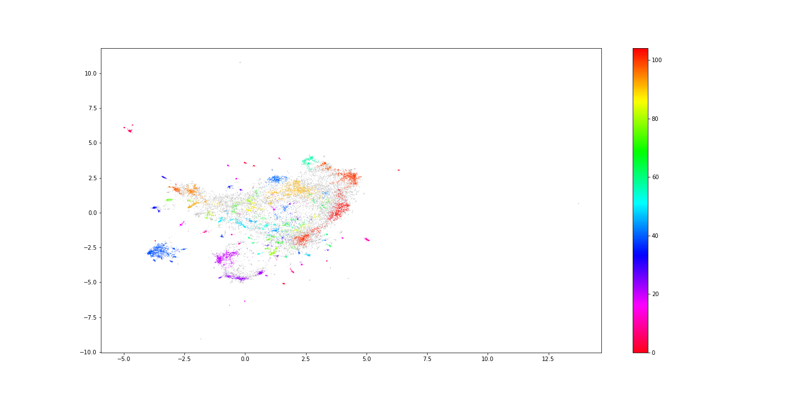

# Capstone-Project
Final project -- clustering webpages

+ installation steps 

+ Azure 
+ get python file from azure (consume) use this file to use the api--> consume.py

+FastAPI
+ use conda to use new env
+ use requirement file to install all packages

+can put plot (google how to use images in markdown) 

